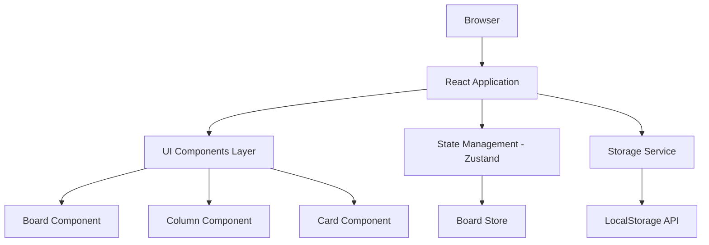
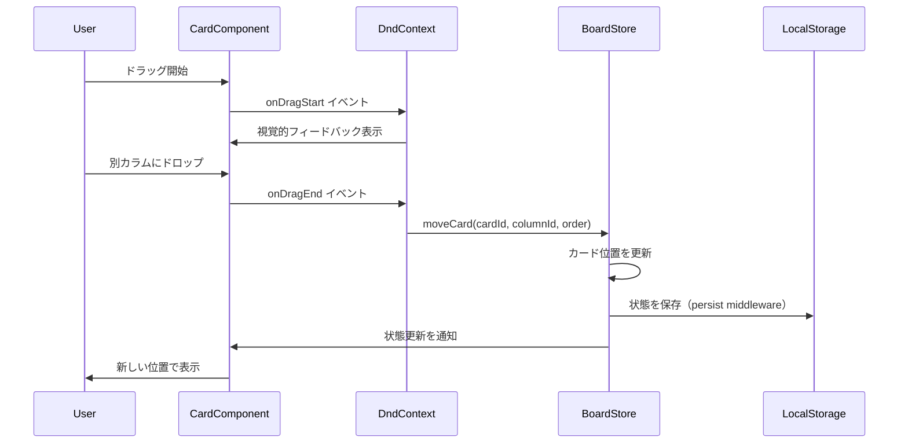
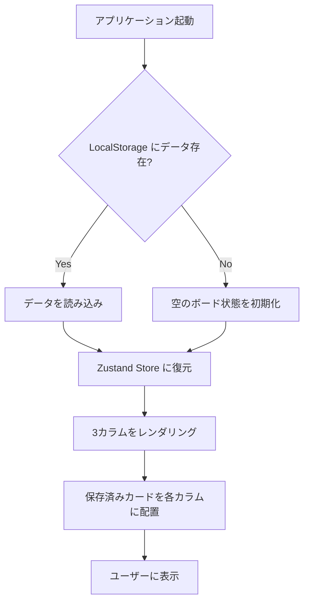

# Technical Design Document

## Overview

このシンプルなカンバンボードアプリケーションは、個人ユーザーに対して視覚的なタスク管理機能を提供します。ユーザーは3つの固定カラム（To Do、In Progress、Done）間でカードをドラッグ&ドロップすることで、直感的にタスクの状態を管理できます。

**Purpose**: 個人やチームが、ブラウザ単体で完結する軽量なタスク管理ツールを利用し、タスクの視覚的な整理と進捗管理を実現します。

**Users**: 個人の開発者、プロジェクトマネージャー、または小規模チームが、日々のタスク管理、プロジェクト進捗の可視化、ワークフロー管理に活用します。

**Impact**: 新規アプリケーションの構築となるため、既存システムへの影響はありません。ブラウザのローカルストレージにデータを保存することで、サーバーレスでの動作を実現します。

### Goals

- ドラッグ&ドロップによる直感的なカード移動機能の実装
- ローカルストレージを活用したデータ永続化
- レスポンシブでアクセシブルなユーザーインターフェースの提供
- 軽量で高速な動作を実現する技術スタックの採用

### Non-Goals

- マルチユーザー対応やリアルタイム同期機能（将来的な拡張として検討）
- サーバーサイドでのデータ管理
- カラム数のカスタマイズ機能（3カラム固定）
- カードの詳細説明、添付ファイル、コメント機能などの高度な機能
- 認証・認可機能

## Architecture

### High-Level Architecture



**アーキテクチャパターン**: コンポーネントベースのSPA（Single Page Application）アーキテクチャ

- **Presentation Layer**: React コンポーネントによるUIレンダリング
- **State Management Layer**: Zustand による軽量な状態管理
- **Storage Layer**: ブラウザ LocalStorage APIによるデータ永続化

### Technology Stack and Design Decisions

#### Frontend Framework
- **選定**: React 18+ with TypeScript
- **理由**:
  - コンポーネントベースの開発による再利用性とメンテナンス性
  - TypeScriptによる型安全性の確保
  - 豊富なエコシステムとコミュニティサポート
- **代替案**:
  - Vue.js: 学習コストは低いが、Reactのエコシステムが豊富
  - Svelte: ビルドサイズは小さいが、ライブラリのエコシステムが限定的

#### Build Tool
- **選定**: Vite
- **理由**:
  - 高速な開発サーバー起動とHMR（Hot Module Replacement）
  - ネイティブESモジュール対応による最適化
  - 2025年のReact開発におけるデファクトスタンダード
- **代替案**:
  - Create React App: 非推奨（2025年時点）
  - Webpack: 設定が複雑で開発体験が劣る

#### State Management
- **選定**: Zustand
- **理由**:
  - 軽量（<1KB gzipped）でボイラープレートが少ない
  - TypeScriptのファーストクラスサポート
  - シンプルなアプリケーションに最適な学習コストの低さ
- **代替案**:
  - Redux Toolkit: 過剰な機能とボイラープレート
  - React Context: 再レンダリング最適化が困難

#### Drag and Drop Library
- **選定**: @dnd-kit
- **理由**:
  - モダンで軽量（10KB minified）
  - アクセシビリティのビルトインサポート（キーボード操作対応）
  - カスタマイズ性が高く、パフォーマンスに優れる
  - HTML5 Drag and Drop APIに依存しない設計
- **代替案**:
  - react-beautiful-dnd: メンテナンスが停止気味
  - React DnD: 複雑な設定と大きなバンドルサイズ

#### Styling
- **選定**: Tailwind CSS
- **理由**:
  - 使い慣れているため

#### Data Storage
- **選定**: LocalStorage API
- **理由**:
  - ブラウザネイティブAPIで追加ライブラリ不要
  - シンプルなkey-value構造で十分
  - 同期的なアクセスで実装がシンプル
- **代替案**:
  - IndexedDB: 小規模データには過剰で複雑
  - SessionStorage: ブラウザ終了でデータ消失

### Key Design Decisions

#### Decision 1: Zustand による状態管理の集中化

**Context**: カードの作成、編集、削除、移動などの操作を複数コンポーネント間で共有する必要があります。

**Alternatives**:
- React Context API: グローバル状態管理は可能だが、再レンダリング最適化が困難
- Redux Toolkit: 強力だがボイラープレートが多く、小規模アプリには過剰
- Component State: 親子間でのprops drilling が発生し、保守性が低下

**Selected Approach**: Zustand で単一のBoardStoreを作成し、カード配列とカラム情報を管理します。

```typescript
interface BoardStore {
  cards: Card[];
  addCard: (columnId: string, title: string) => void;
  updateCard: (id: string, updates: Partial<Card>) => void;
  deleteCard: (id: string) => void;
  moveCard: (cardId: string, targetColumnId: string, newOrder: number) => void;
}
```

**Rationale**:
- 最小限のボイラープレートで状態管理を実現
- TypeScript の型推論によるタイプセーフな状態アクセス
- selector機能による効率的な再レンダリング制御

**Trade-offs**:
- 獲得: シンプルな実装、小さいバンドルサイズ、優れた開発者体験
- 犠牲: Redux のようなミドルウェアエコシステムや開発ツールの充実度

#### Decision 2: @dnd-kit/sortable による並び替え実装

**Context**: カードを同一カラム内で並び替え、かつ異なるカラム間で移動する必要があります。

**Alternatives**:
- HTML5 Drag and Drop API: ネイティブだが、カスタマイズ性に欠け、アクセシビリティに課題
- react-beautiful-dnd: 人気だが、メンテナンス停止気味で将来性に不安
- 手動実装: フルコントロール可能だが、アクセシビリティとブラウザ互換性の実装コストが高い

**Selected Approach**: @dnd-kit/core と @dnd-kit/sortable を組み合わせて実装します。

```typescript
// 複数コンテナ（カラム）間のソート可能リスト
<DndContext sensors={sensors} collisionDetection={closestCenter} onDragEnd={handleDragEnd}>
  <SortableContext items={cardIds} strategy={verticalListSortingStrategy}>
    {cards.map(card => <SortableCard key={card.id} card={card} />)}
  </SortableContext>
</DndContext>
```

**Rationale**:
- ビルトインのキーボードナビゲーションとスクリーンリーダー対応
- カスタムアニメーションとトランジションの柔軟な実装
- 仮想化リストとの互換性（将来的な拡張性）

**Trade-offs**:
- 獲得: アクセシビリティ、パフォーマンス、拡張性
- 犠牲: デスクトップからのドラッグやウィンドウ間ドラッグは不可

#### Decision 3: LocalStorage 同期型永続化戦略

**Context**: 状態変更を即座にローカルストレージに反映し、リロード時にデータを復元する必要があります。

**Alternatives**:
- debounce/throttle 保存: 書き込み頻度を制限するが、データ損失リスクあり
- 手動保存ボタン: ユーザー操作が必要で UX が低下
- IndexedDB: 非同期APIで実装が複雑化

**Selected Approach**: Zustand のミドルウェア機能で状態変更を監視し、同期的に LocalStorage に保存します。

```typescript
const useBoardStore = create<BoardStore>()(
  persist(
    (set) => ({
      cards: [],
      addCard: (columnId, title) => set((state) => ({
        cards: [...state.cards, createCard(columnId, title)]
      })),
      // ... 他のアクション
    }),
    {
      name: 'kanban-board-storage',
      storage: createJSONStorage(() => localStorage),
    }
  )
);
```

**Rationale**:
- Zustand の persist ミドルウェアによる自動保存・復元
- 状態変更が即座に永続化され、データ損失リスクを最小化
- シンプルな実装で、追加のエラーハンドリングが容易

**Trade-offs**:
- 獲得: 自動保存によるシームレスな UX、実装のシンプルさ
- 犠牲: 頻繁な書き込みによるわずかなパフォーマンスオーバーヘッド（実用上は無視可能）

## System Flows

### カード移動フロー



### アプリケーション起動フロー



## Components and Interfaces

### Presentation Layer

#### Board Component

**Responsibility & Boundaries**
- **Primary Responsibility**: カンバンボード全体のレイアウトとドラッグ&ドロップコンテキストの提供
- **Domain Boundary**: UI表示層、ドラッグ&ドロップのオーケストレーション
- **Data Ownership**: なし（Zustand Store から読み取りのみ）

**Dependencies**
- **Inbound**: なし（ルートコンポーネント）
- **Outbound**: Column Component、BoardStore（Zustand）
- **External**: @dnd-kit/core

**Contract Definition**

```typescript
interface BoardProps {
  // プロパティなし（ルートコンポーネント）
}

const Board: React.FC<BoardProps> = () => {
  // DndContext と3つのColumnコンポーネントをレンダリング
  // onDragEnd ハンドラーで BoardStore の moveCard を呼び出し
};
```

#### Column Component

**Responsibility & Boundaries**
- **Primary Responsibility**: 単一カラムの表示と、そのカラムに属するカードのリスト表示
- **Domain Boundary**: UI表示層、カード追加UIの管理
- **Data Ownership**: なし（カラムIDと表示名を受け取り、カードはStoreから取得）

**Dependencies**
- **Inbound**: Board Component
- **Outbound**: Card Component、AddCardForm Component、BoardStore
- **External**: @dnd-kit/sortable

**Contract Definition**

```typescript
interface ColumnProps {
  id: ColumnId; // 'todo' | 'in-progress' | 'done'
  title: string; // カラム表示名
}

const Column: React.FC<ColumnProps> = ({ id, title }) => {
  // BoardStore から該当カラムのカードを取得
  // SortableContext でカードリストをラップ
  // AddCardForm を表示
};
```

**Preconditions**: カラムIDが有効な値（'todo', 'in-progress', 'done'）であること
**Postconditions**: カードが並び順に従って表示され、ドロップ可能な領域として機能すること

#### Card Component

**Responsibility & Boundaries**
- **Primary Responsibility**: 個別カードの表示、編集、削除UI
- **Domain Boundary**: UI表示層、カード単体の操作
- **Data Ownership**: なし（カードデータを受け取り、変更は Store 経由）

**Dependencies**
- **Inbound**: Column Component
- **Outbound**: BoardStore（編集・削除操作）
- **External**: @dnd-kit/sortable

**Contract Definition**

```typescript
interface CardProps {
  card: Card;
}

interface Card {
  id: string;
  title: string;
  columnId: ColumnId;
  order: number;
}

const Card: React.FC<CardProps> = ({ card }) => {
  // useSortable フックでドラッグ&ドロップ機能を付与
  // ダブルクリックで編集モード
  // 削除ボタンで削除
};
```

**Preconditions**: card オブジェクトが有効なプロパティを持つこと
**Postconditions**: ユーザー操作に応じて編集モード切り替え、削除、またはドラッグ開始

#### AddCardForm Component

**Responsibility & Boundaries**
- **Primary Responsibility**: 新規カード作成のためのインプットフォーム
- **Domain Boundary**: UI表示層、入力バリデーション
- **Data Ownership**: なし（入力値を BoardStore の addCard に渡す）

**Dependencies**
- **Inbound**: Column Component
- **Outbound**: BoardStore（addCard アクション）
- **External**: なし

**Contract Definition**

```typescript
interface AddCardFormProps {
  columnId: ColumnId;
}

const AddCardForm: React.FC<AddCardFormProps> = ({ columnId }) => {
  // テキスト入力フィールドと追加ボタン
  // 空文字列の場合は追加を拒否
  // 有効な入力時に BoardStore.addCard を呼び出し
};
```

**Preconditions**: columnId が有効であること
**Postconditions**: 有効なタイトルが入力された場合のみカードが作成されること

### State Management Layer

#### BoardStore (Zustand Store)

**Responsibility & Boundaries**
- **Primary Responsibility**: アプリケーション全体のカード状態の管理と永続化
- **Domain Boundary**: 状態管理、ビジネスロジック
- **Data Ownership**: Card配列の管理、カラム定義

**Dependencies**
- **Inbound**: すべてのReactコンポーネント
- **Outbound**: StorageService
- **External**: zustand、zustand/middleware

**Contract Definition**

```typescript
interface BoardStore {
  cards: Card[];

  // カード作成
  addCard: (columnId: ColumnId, title: string) => void;

  // カード更新
  updateCard: (id: string, updates: Partial<Card>) => void;

  // カード削除
  deleteCard: (id: string) => void;

  // カード移動
  moveCard: (cardId: string, targetColumnId: ColumnId, newOrder: number) => void;

  // カラムごとのカード取得（selector）
  getCardsByColumn: (columnId: ColumnId) => Card[];
}

// 使用例
const cards = useBoardStore((state) => state.cards);
const addCard = useBoardStore((state) => state.addCard);
```

**Preconditions**:
- addCard: タイトルが空文字列でないこと
- updateCard: カードIDが存在すること
- deleteCard: カードIDが存在すること
- moveCard: カードIDとカラムIDが有効であること

**Postconditions**:
- すべての操作後、LocalStorage に状態が自動保存されること
- cards配列が常にorder順にソートされていること

**Invariants**:
- カードIDはシステム内で一意であること
- カードの order 値はカラム内でユニークであること

### Storage Layer

#### StorageService

**Responsibility & Boundaries**
- **Primary Responsibility**: LocalStorage への読み書き、JSON シリアライズ/デシリアライズ
- **Domain Boundary**: データ永続化層
- **Data Ownership**: LocalStorage キーの管理

**Dependencies**
- **Inbound**: BoardStore (Zustand persist middleware)
- **Outbound**: Browser LocalStorage API
- **External**: なし

**Contract Definition**

```typescript
interface StorageService {
  saveState: (key: string, state: BoardState) => Result<void, StorageError>;
  loadState: (key: string) => Result<BoardState | null, StorageError>;
  clearState: (key: string) => Result<void, StorageError>;
}

type BoardState = {
  cards: Card[];
  version: number; // スキーマバージョン
};

type StorageError =
  | { type: 'QUOTA_EXCEEDED'; message: string }
  | { type: 'SERIALIZATION_ERROR'; message: string }
  | { type: 'PERMISSION_DENIED'; message: string };

type Result<T, E> = { success: true; data: T } | { success: false; error: E };
```

**Preconditions**:
- saveState: state が有効な BoardState 型であること
- loadState: key が空文字列でないこと

**Postconditions**:
- saveState成功時: LocalStorage にJSON形式でデータが保存されること
- loadState成功時: 有効な BoardState が返却されること
- エラー時: 適切なエラー型が返却されること

**Error Handling**:
- QuotaExceededError: ストレージ上限に達した場合のエラーハンドリング
- Serialization Error: 不正なデータ構造の場合の検出

## Data Models

### Domain Model

#### Core Entities

**Card Entity**
```typescript
interface Card {
  id: string;           // UUID v4 形式の一意識別子
  title: string;        // カードタイトル（1-500文字）
  columnId: ColumnId;   // 所属カラムID
  order: number;        // カラム内の並び順（0始まり）
  createdAt: number;    // 作成日時（Unix timestamp）
  updatedAt: number;    // 更新日時（Unix timestamp）
}
```

**Column Value Object**
```typescript
type ColumnId = 'todo' | 'in-progress' | 'done';

interface ColumnDefinition {
  id: ColumnId;
  title: string;        // 表示名（例: "To Do", "In Progress", "Done"）
  order: number;        // ボード上の表示順
}

const COLUMNS: readonly ColumnDefinition[] = [
  { id: 'todo', title: 'To Do', order: 0 },
  { id: 'in-progress', title: 'In Progress', order: 1 },
  { id: 'done', title: 'Done', order: 2 },
] as const;
```

**Business Rules & Invariants**:
- カードタイトルは必須（空文字列不可）
- カードIDはUUID v4形式で一意性を保証
- order値はカラム内で連続した整数（0, 1, 2, ...）
- columnId は定義済みの3つの値のみ許可
- createdAt は不変、updatedAt は編集時に更新

### Logical Data Model

**State Structure**
```typescript
interface BoardState {
  cards: Card[];
  version: number; // データスキーマバージョン（マイグレーション用）
}
```

**Relationships**:
- 1つのカードは必ず1つのカラムに所属（1:N関係）
- カラムは複数のカードを持つ（0個以上）
- カードの order はカラム内でソート順を決定

**Consistency Rules**:
- カード削除時、同一カラム内の後続カードの order を再計算
- カード移動時、移動元と移動先の両方のカラムで order を再計算
- 複数カードの order が重複しないことを保証

### Physical Data Model

#### LocalStorage Schema

**Key**: `kanban-board-storage`

**Value Structure** (JSON):
```json
{
  "state": {
    "cards": [
      {
        "id": "550e8400-e29b-41d4-a716-446655440000",
        "title": "Sample Task",
        "columnId": "todo",
        "order": 0,
        "createdAt": 1704067200000,
        "updatedAt": 1704067200000
      }
    ],
    "version": 1
  },
  "version": 0
}
```

**Storage Constraints**:
- 最大サイズ: ~5MB（ブラウザごとに異なる）
- データ形式: UTF-16 JSON文字列
- 推定カード数上限: ~10,000件（平均タイトル長50文字の場合）

**Indexing**:
- LocalStorage はkey-value構造のため、インデックス不要
- アプリケーション層で cards 配列を columnId と order でフィルタリング・ソート

### Data Contracts & Integration

#### LocalStorage Data Contract

**Write Contract**:
```typescript
// Zustand persist middleware が自動的に呼び出し
localStorage.setItem('kanban-board-storage', JSON.stringify({
  state: boardState,
  version: 0
}));
```

**Read Contract**:
```typescript
const stored = localStorage.getItem('kanban-board-storage');
if (stored) {
  const { state } = JSON.parse(stored);
  // state.version を確認してマイグレーション実行（必要時）
  return state;
}
```

**Schema Versioning Strategy**:
- version フィールドでスキーマバージョンを管理
- 将来的なフィールド追加時、古いバージョンからのマイグレーション関数を実装
- マイグレーション例:
```typescript
function migrateSchema(data: unknown, fromVersion: number): BoardState {
  if (fromVersion === 1 && currentVersion === 2) {
    // version 1 → 2 へのマイグレーション処理
    return { ...data, newField: defaultValue };
  }
  return data as BoardState;
}
```

**Error Recovery**:
- JSON parse エラー時: LocalStorage をクリアして空の状態で起動
- version 不整合時: マイグレーション試行、失敗時はクリア

## Error Handling

### Error Strategy

アプリケーション全体で統一されたエラーハンドリング戦略を採用し、ユーザーに適切なフィードバックを提供します。エラーは以下の3つのカテゴリに分類され、それぞれ異なる対応を行います。

### Error Categories and Responses

#### User Errors（ユーザー起因のエラー）

**空のカードタイトル**
- **検出**: AddCardForm コンポーネントの送信ハンドラー
- **対応**: フォームのバリデーションエラーメッセージを表示
```typescript
if (title.trim() === '') {
  setError('カードタイトルを入力してください');
  return;
}
```

**無効なカラムIDでのカード作成**
- **検出**: BoardStore の addCard アクション内
- **対応**: コンソールエラーログ + ユーザーへのトーストメッセージ
```typescript
if (!VALID_COLUMN_IDS.includes(columnId)) {
  console.error(`Invalid columnId: ${columnId}`);
  showToast('カードの作成に失敗しました', 'error');
  return;
}
```

#### System Errors（システムエラー）

**LocalStorage Quota Exceeded**
- **検出**: Zustand persist middleware の onError コールバック
- **対応**: ユーザーに警告を表示し、古いデータの削除を促す
```typescript
persist(
  // store definition
  {
    name: 'kanban-board-storage',
    onError: (error) => {
      if (error.name === 'QuotaExceededError') {
        showToast('ストレージ容量が不足しています。古いデータを削除してください。', 'warning');
      }
    }
  }
);
```

**LocalStorage アクセス不可（プライベートモード等）**
- **検出**: アプリケーション初期化時の LocalStorage 可用性チェック
- **対応**: 警告バナーを表示し、セッションのみのモードで動作
```typescript
try {
  localStorage.setItem('test', 'test');
  localStorage.removeItem('test');
} catch (e) {
  showBanner('プライベートモードのため、データは保存されません', 'warning');
  // セッションストレージへのフォールバック
}
```

**JSON Parse エラー（破損したデータ）**
- **検出**: LocalStorage 読み込み時
- **対応**: データをクリアして空の状態で起動、ユーザーに通知
```typescript
try {
  const data = JSON.parse(stored);
  return data.state;
} catch (e) {
  console.error('Failed to parse stored data', e);
  localStorage.removeItem('kanban-board-storage');
  showToast('保存データが破損していたため、初期化しました', 'info');
  return { cards: [], version: 1 };
}
```

#### Business Logic Errors（ビジネスロジックエラー）

**存在しないカードの編集/削除**
- **検出**: BoardStore のアクション内
- **対応**: 操作を無視し、コンソールログを出力（通常発生しない）
```typescript
deleteCard: (id) => set((state) => {
  const cardExists = state.cards.some(c => c.id === id);
  if (!cardExists) {
    console.warn(`Card ${id} not found for deletion`);
    return state;
  }
  return { cards: state.cards.filter(c => c.id !== id) };
});
```

**同一カラム内でのorder重複**
- **検出**: moveCard アクション実行後の整合性チェック
- **対応**: order値を自動的に再計算して整合性を保つ
```typescript
function recalculateOrder(cards: Card[], columnId: ColumnId): Card[] {
  return cards
    .filter(c => c.columnId === columnId)
    .sort((a, b) => a.order - b.order)
    .map((card, index) => ({ ...card, order: index }));
}
```

### Monitoring

**Error Logging**:
- 開発環境: console.error でスタックトレースを出力
- 本番環境: 将来的には Sentry 等のエラートラッキングサービスへの送信を検討

**Health Monitoring**:
- LocalStorage の利用可能容量の監視（navigator.storage.estimate）
- カード数が1000件を超えた場合の警告表示

## Testing Strategy

### Unit Tests

1. **BoardStore アクション**:
   - addCard が正しくカードを追加し、order を設定すること
   - deleteCard が指定カードを削除し、order を再計算すること
   - moveCard がカードを別カラムに移動し、両方のカラムで order を更新すること
   - updateCard がカードのタイトルと updatedAt を更新すること

2. **StorageService**:
   - saveState が有効なJSONをLocalStorageに保存すること
   - loadState が保存されたデータを正しくデシリアライズすること
   - エラー時に適切な Result<T, E> 型を返すこと

3. **ユーティリティ関数**:
   - generateCardId が UUID v4 形式の文字列を生成すること
   - recalculateOrder が連続したorder値を割り当てること

### Integration Tests

1. **カード作成フロー**:
   - AddCardForm でタイトルを入力し、送信ボタンをクリック
   - BoardStore の addCard が呼ばれ、カードが追加されること
   - LocalStorage に新しいカードが保存されること

2. **カード移動フロー**:
   - カードをドラッグして別カラムにドロップ
   - BoardStore の moveCard が正しい引数で呼ばれること
   - UIが更新され、カードが新しいカラムに表示されること

3. **データ永続化と復元**:
   - カードを作成し、ページをリロード
   - LocalStorage からデータが読み込まれること
   - 作成したカードが正しく表示されること

### E2E Tests

1. **基本的なカンバンワークフロー**:
   - To Do カラムにカードを3つ作成
   - 1つ目のカードを In Progress に移動
   - 2つ目のカードを Done に移動
   - 3つ目のカードを削除
   - ページをリロードして、変更が永続化されていることを確認

2. **カード編集フロー**:
   - カードをダブルクリックして編集モードに入る
   - タイトルを変更して Enter キーで確定
   - 変更が反映され、LocalStorage に保存されること

3. **レスポンシブ動作**:
   - モバイルビューポート（375px）でカラムが縦に並ぶこと
   - タブレットビューポート（768px）でカラムが横に並ぶこと

4. **アクセシビリティ**:
   - Tab キーでフォーカスが論理的に移動すること
   - Enter/Space キーでボタンが実行されること
   - スクリーンリーダーが適切なARIAラベルを読み上げること

### Performance Tests

1. **大量カードの表示**:
   - 1000件のカードを生成し、レンダリング時間を測定（<2秒）
   - スクロールがスムーズであること

2. **ドラッグ操作のレスポンス**:
   - カードドラッグ時のフレームレート維持（60fps）
   - ドロップ操作後の状態更新が即座に反映されること（<100ms）

3. **LocalStorage 読み書き性能**:
   - 100件のカードを含む状態の保存時間（<50ms）
   - 起動時のデータ読み込み時間（<100ms）

## Security Considerations

### Client-Side Security

**XSS対策**:
- React のデフォルトのエスケープ機能により、カードタイトルのXSS脆弱性を防止
- dangerouslySetInnerHTML は使用しない

**LocalStorage データの取り扱い**:
- LocalStorage はドメイン内の全JavaScriptからアクセス可能
- 機密情報（個人情報、認証トークンなど）は保存しない
- 現状、カードタイトルのみを保存するため、セキュリティリスクは低い

**Content Security Policy (CSP)**:
- 将来的には CSP ヘッダーを設定し、インラインスクリプトの実行を制限

### Data Privacy

**個人情報の非保存**:
- ユーザー識別情報、メールアドレス、名前などは保存しない
- カードタイトルに個人情報が含まれる可能性があることをユーザーに注意喚起（プライバシーポリシー）

**ブラウザ間のデータ分離**:
- LocalStorage はオリジン単位で分離されるため、他のサイトからアクセス不可
- プライベートモードでは LocalStorage が使用できないことをユーザーに通知

## Performance & Scalability

### Target Metrics

- **初回レンダリング時間**: <1秒（100件のカード）
- **カード追加・削除操作**: <100ms
- **ドラッグ&ドロップ操作**: 60fps維持
- **LocalStorage 読み書き**: <50ms

### Scaling Approaches

**カード数の増加に対応**:
- 現状は ~1000件までのカードを想定
- それ以上の場合、仮想化（react-window）の導入を検討
- LocalStorage の容量制限（~5MB）に注意

**パフォーマンス最適化**:
- React.memo でカードコンポーネントの再レンダリングを抑制
- Zustand selector で必要な状態のみをサブスクライブ
- useMemo/useCallback で計算コストの高い処理をメモ化

### Caching Strategies

**コンポーネントレベルのキャッシング**:
- カードコンポーネントは card.id をキーに React.memo でメモ化
- カラムごとのカードリストは useMemo でキャッシュ

**LocalStorage キャッシング**:
- Zustand persist middleware が自動的に状態変更を検知して保存
- 読み込みは起動時のみ、以降はメモリ上の状態を使用
